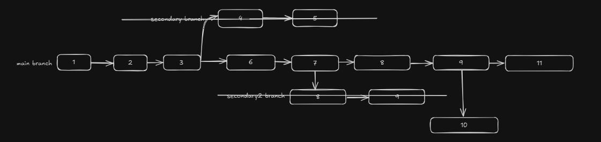

# Git and GitHub

## Introduction

Git is a **Version Control System (VCS)** or **Source Code Management (SCM)** tool that helps developers manage and track changes to their codebase efficiently. GitHub is a platform that hosts Git repositories remotely, enabling collaboration and code sharing.

### Key Features of Git

- **Version Control for Bug Fixing**: Easily roll back to previous versions if needed.
- **Collaboration**: Synchronize progress among team members.
- **Non-linear Development**: Work on multiple tasks simultaneously using branches that can be merged later.

A quick tip 😉: Get used to writing commit messages in the present tense—it’s a better practice.

## Git Workflow

### End-to-End Workflow

1. Add changes to the **staging area**: `git add <file>` or `git add .` (for all changes).
2. Commit the changes to the **local repository**: `git commit -m "Commit message"`.
3. Push the changes to a **remote repository** (e.g., GitHub): `git push`.

### Example

1. Complete today’s work:
   ```bash
   git add .
   git commit -m "Work done for the day"
   git push
   ```
2. Resume tomorrow from the same place where you left today, minimizing the risk of code loss.

## Git Commands for Beginners

### Basic Commands

- **Initialize a repository**:
  ```bash
  git init
  ```
  Creates a new Git repository in the current folder.

- **Check status**:
  ```bash
  git status
  ```
  Shows the status of changes (e.g., tracked, untracked, staged, modified).

- **Stage changes**:
  ```bash
  git add <file>
  git add .
  ```
  Adds files to the staging area (ready for commit).

- **Commit changes**:
  ```bash
  git commit -m "Message"
  ```
  Saves changes to the local repository with a descriptive message.

- **Ignore files**: Create a `.gitignore` file and list filenames or patterns to exclude from tracking. Useful when you have stored passwords or some confidential keys in your repository.

- **View commit history**:
  - Concise history:
    ```bash
    git log --oneline
    ```
  - Detailed with file changes:
    ```bash
    git log --stat
    ```
  - Commit-level code changes:
    ```bash
    git log -p
    ```

- **Rollback to a previous commit**:
  1. View the commit history:
     ```bash
     git log --oneline
     ```
  2. Copy the SHA ID of the desired commit, e.g., `6c055a7`.
  3. Check out the commit:
     ```bash
     git checkout 6c055a7
     ```

## Branching in Git

Branching is essential for collaboration and testing new features without affecting the main working system.

### Creating and Managing Branches

- **Create a branch**:
  ```bash
  git branch <branch_name>
  ```

- **Switch to a branch**:
  ```bash
  git checkout <branch_name>
  ```

- **View branches**:
  ```bash
  git branch
  ```
  Displays all branches, with the current branch marked by `*`.

- **Create a branch from a specific commit**:
  ```bash
  git branch <branch_name> <SHA_ID>
  ```

- **Delete a branch**:
  - Safe delete (only if merged):
    ```bash
    git branch -d <branch_name>
    ```
  - Force delete (even if not merged):
    ```bash
    git branch -D <branch_name>
    ```

### Example Workflow

1. Create and switch to a new branch:
   ```bash
   git branch feature-branch
   git checkout feature-branch
   ```
2. Make changes, stage, and commit:
   ```bash
   git add .
   git commit -m "Add feature"
   ```
3. Merge back into the main branch:
   ```bash
   git checkout main
   git merge feature-branch
   ```
4. Delete the branch:
   ```bash
   git branch -d feature-branch
   ```

### Visualizing Branches

- Show all branches with a graph:
  ```bash
  git log --oneline --all --graph
  ```

### Example: Diverging Branches

1. **Main branch commits**: Suppose we have made 3 commits already in main branch so far which are `1`, `2`, `3`, now create a clone of the main branch from the third commit.
2. **Create `secondary` branch from commit `3`**:
   ```bash
   git branch secondary
   ```
3. **Commit changes**:
   - `secondary` branch: Commit `4`, `5`.
   - `main` branch: Commit `6`, `7`.
4. **View logs**:
   - Current branch:
     ```bash
     git log --oneline
     ```
   - All branches:
     ```bash
     git log --oneline --all --graph
     ```

   

4. **Delete the secondary branch**:
   - Switch to the `main` branch:
     ```bash
     git checkout main
     ```
   - Delete the `secondary` branch forcefully:
     ```bash
     git branch -D secondary
     ```

   

## Merging in Git

### Simple Merge

1. Create a branch (`secondary2`) from commit no.`7` made earlier and add commits `8`, `9` in the new branch.
2. Merge into `main`:
   ```bash
   git checkout main
   ```
   
3. Merge to the main branch:
   ```bash
   git merge secondary2
   ```
   The `main` branch now contains all commits from `secondary2` (fast-forwarded to commit `9`), due to which this type of merge is also called fast forward merge.
3. Delete the merged branch:
   ```bash
   git branch -D secondary2
   ```
   

### Merge Conflicts
Create a new branch final from the 9th commit we made from merging the secondary2 branch to the final.
1. **Create conflicting branches**:
   - On `main`, modify a line in `first.py` and commit (`10`).
   - On `final`, modify the same line and commit (`11`).

2. **Merge `final` into `main`**:
   ```bash
   git checkout main
   git merge final
   ```
   A conflict arises because both branches modified the same line.
   

3. **Resolve conflicts**:
   - Use an editor (e.g., VS Code) to choose:
     - **Keep Current Change**: Retain `main`’s version.
     - **Accept Incoming Change**: Use `final`’s version.
     - **Keep Both Changes**: Combine changes manually.

4. **Commit the resolution**:
   ```bash
   git add .
   git commit -m "Resolve merge conflict"
   ```

## Uploading Empty Folders Using `.gitkeep`

Git does not track empty folders by default. To include an empty folder in a repository, add a `.gitkeep` file inside it:

1. Create the folder:
   ```bash
   mkdir empty_folder
   ```
2. The command will create the `.gitkeep` file :
   ```bash
   touch empty_folder/.gitkeep
   ```
3. Stage and commit:
   ```bash
   git add empty_folder/.gitkeep
   git commit -m "Add empty folder using .gitkeep"
   ```

## Summary

Git is a robust tool for version control, supporting collaborative and non-linear development. By mastering basic commands, branching, merging, conflict resolution, and managing empty folders with `.gitkeep`, you can effectively manage your codebase and streamline team workflows.